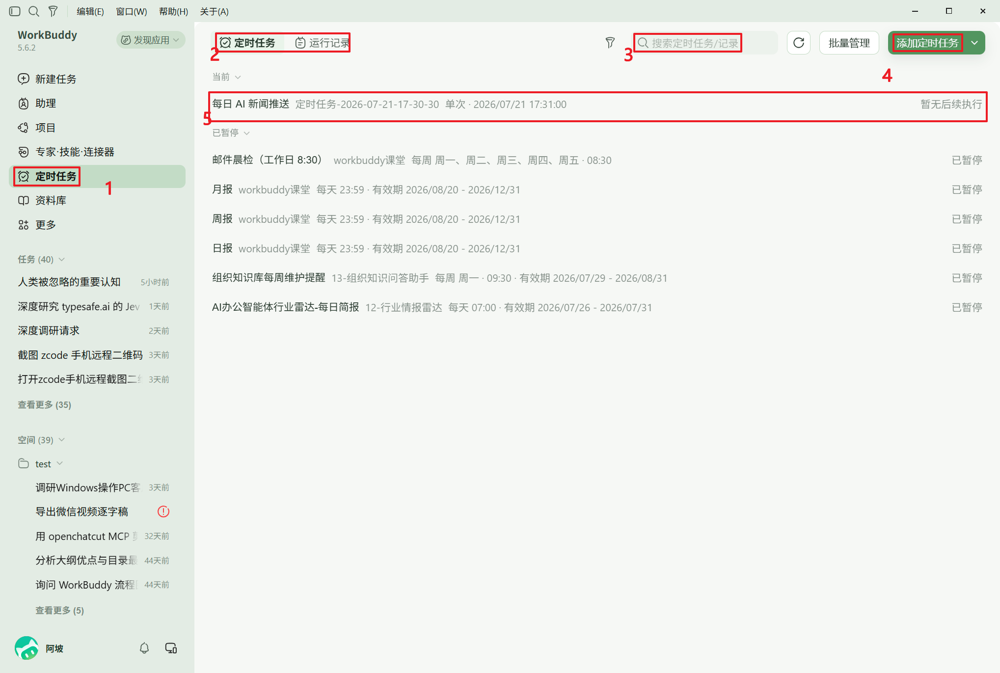
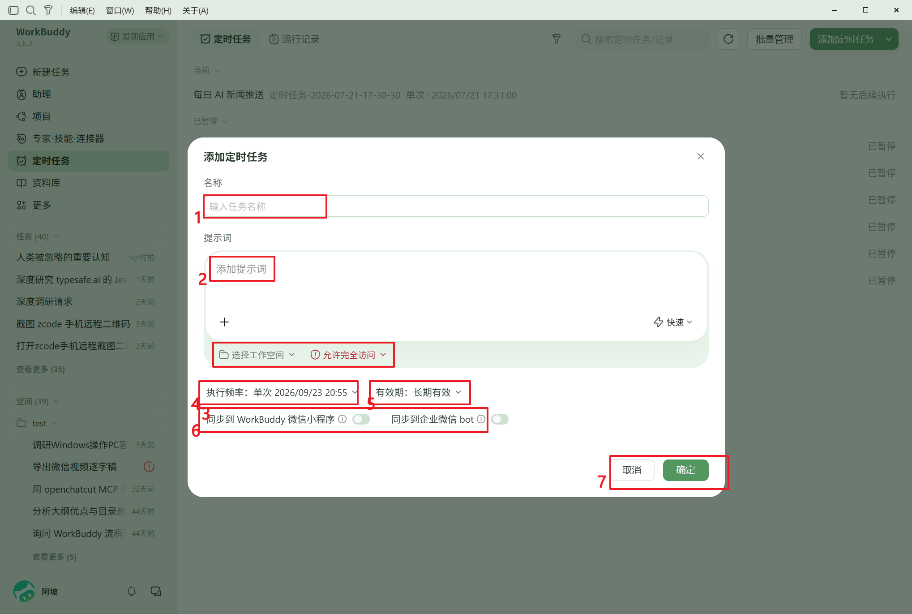
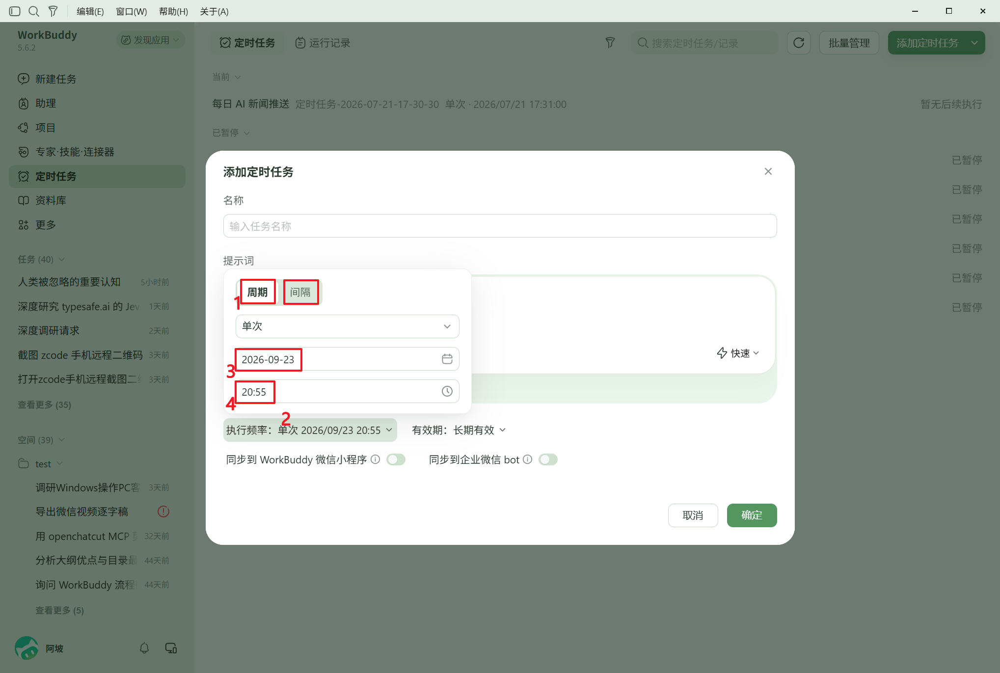
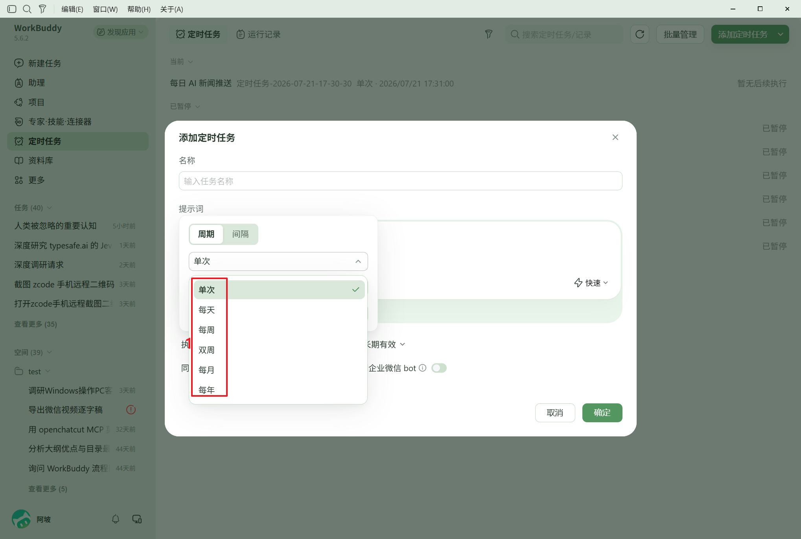
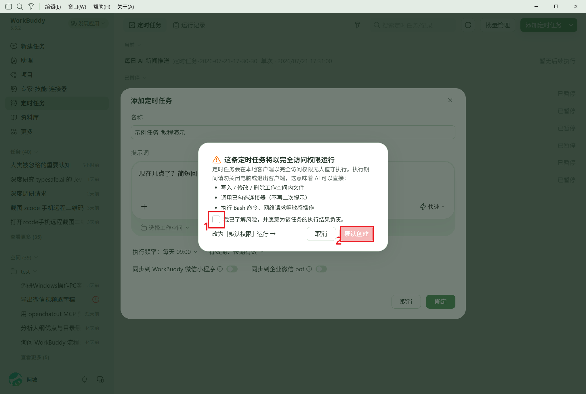
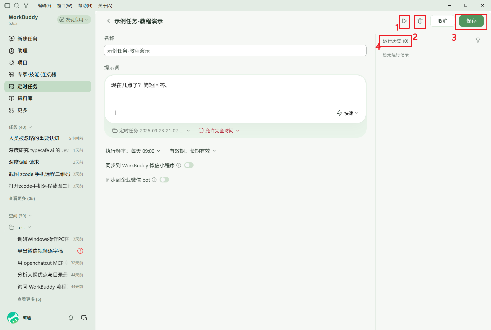
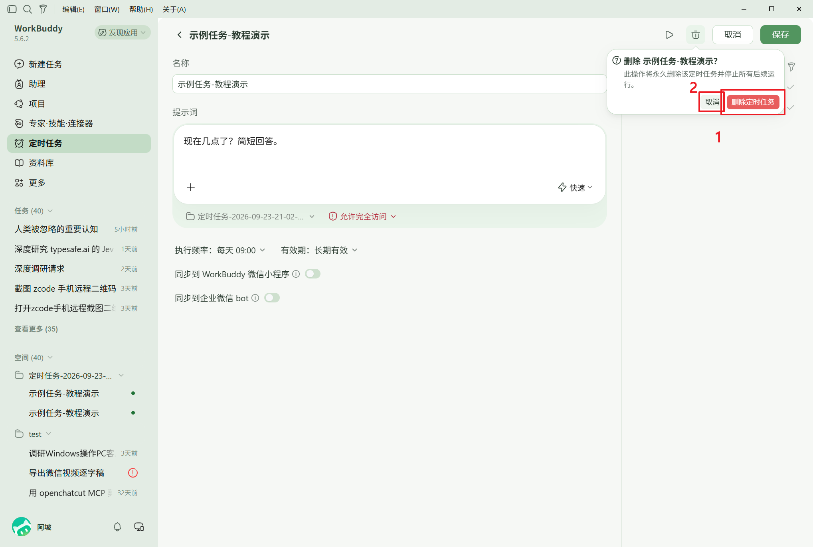

# WorkBuddy 定时任务使用教程

> 适用版本：WorkBuddy 5.6.2（Windows）
> 截图均来自本机实机操作，红框与数字标注为要点位置，正文按数字逐一说明。

---

## 1. 打开定时任务页面

两种入口任选其一：

- **侧边栏入口**：打开 WorkBuddy，点左侧边栏的 **①「定时任务」**；
- **深链直达**：按 `Win+R` 输入 `workbuddy://automation` 回车，直接跳转定时任务页。

页面要点：

| 标注 | 说明 |
|---|---|
| ① | 侧边栏「定时任务」入口 |
| ② | 页内两个页签：**定时任务**（任务管理）/ **运行记录**（执行历史） |
| ③ | 搜索框，可按名称搜索任务与记录 |
| ④ | **添加定时任务**——新建按钮（绿色主按钮） |
| ⑤ | 任务列表：每行显示 名称 + 计划 + 下次执行时间；左侧「已暂停」标记者不会执行 |

## 2. 新建定时任务

点右上角 **④「添加定时任务」**，页面出现创建表单：

| 标注 | 字段 | 说明 |
|---|---|---|
| ① | 名称 | 任务名，方便自己辨认（如"每日站会提醒"） |
| ② | 提示词 | **核心**：到点后 AI 无人值守执行的内容，写清楚要做什么 |
| ③ | 工作空间与权限 | 选择任务运行的工作空间；「允许完全访问」见第 4 节风险说明 |
| ④ | 执行频率 | 单次 / 每天 / 每周 / 双周 / 每月 / 每年（见第 3 节） |
| ⑤ | 有效期 | 默认"长期有效"，也可限定起止日期 |
| ⑥ | 同步开关 | 可选同步到 WorkBuddy 微信小程序 / 企业微信 bot |
| ⑦ | 取消 / 确定 | 完成后点**确定**（会先弹出风险确认，见第 4 节） |

> 实测提示：提示词不填、或"单次"执行时间早于当前时间，点确定会报错
> **"请填写提示词；单次执行时间必须晚于当前时间"**——先补全再保存。

## 3. 设置执行频率

点「执行频率」一行展开编辑器：

- ① **周期**：执行方式；② **间隔**：周期性任务的补充参数；
- ③ **日期**、④ **时间**：单次任务的触发时间点。

点开「周期」下拉，共六种：

**单次 / 每天 / 每周 / 双周 / 每月 / 每年**。周期任务可再配合"有效期"限定范围（例：每周一至周五 08:30，有效期至 2026/12/31）。

## 4. 风险确认（必读）

表单填完点「确定」后，**不会立即创建**，而是弹出风险确认：

- 勾选 **①「我已了解风险，并愿意为该任务的执行结果负责」**；
- 点 **②「确认创建」**，任务才真正创建并出现在列表。

> 为什么有这一步：勾选"允许完全访问"后，任务到点会**无人值守**地以完全访问权限运行 AI——
> 可写入/删除工作空间文件、调用已勾选连接器、执行 Bash 命令与网络请求。
> 执行期间请勿关电脑或退出客户端。只想低调跑任务的话，改用「默认权限」运行。

## 5. 查看与修改任务

在列表点任务名称行，进入详情页：

| 标注 | 说明 |
|---|---|
| ① | **测试运行**：立即触发一次试跑，不影响正式调度（会生成一条运行会话） |
| ② | **删除**：删除该任务（见第 6 节） |
| ③ | **保存**：修改名称/提示词/频率后保存 |
| ④ | **运行历史**：每次执行的记录与结果，点顶部「运行记录」页签也可查看 |

## 6. 删除任务

详情页点 **删除图标（垃圾桶）**，弹出确认框：

- ① 红色 **「删除定时任务」**=确认删除（永久删除并停止所有后续运行）；
- ② 「取消」反悔退出。

## 7. 常用技巧

- **暂停/恢复**：列表中带「已暂停」角标的任务不会执行；在详情页修改后保存即可恢复调度。
- **写好提示词是关键**：定时任务的本质是"到点把这段提示词交给 AI 执行"，写清输入来源与期望产出，效果远好于一句模糊指令。
- **让 AI Agent 代管**：WorkBuddy 内置 `CronCreate / CronList / CronDelete` 工具，直接在对话里说"每天早上 9 点帮我总结 XX 并推送"，Agent 即可代为创建/查询/删除定时任务。
- **单次任务的时间必须晚于当前时间**，否则无法保存。

---

*本教程截图与操作验证：2026-09-23 实机完成（创建"示例任务-教程演示"→ 列表可见 → 删除，全链路闭环）。*
